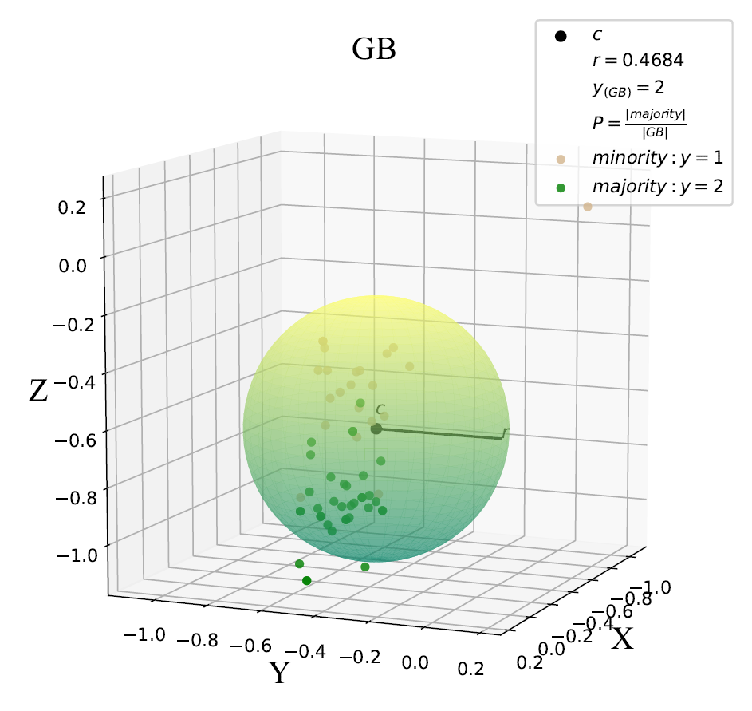
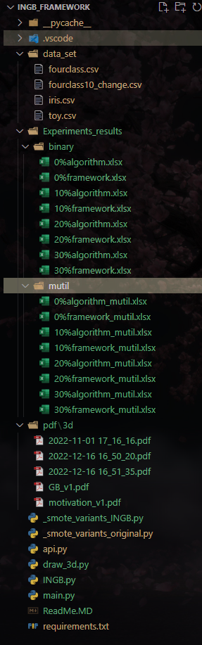
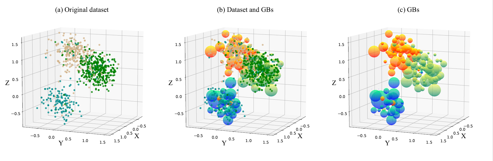

<!--
 * @Author: Zhou Hao
 * @Date: 2022-04-07 18:04:04
 * @LastEditors: Zhou Hao
 * @LastEditTime: 2022-04-07 18:15:56
 * @Description: file content
 * @E-mail: 2294776770@qq.com
-->

# INGB: Informed Nonlinear Granular Ball Oversampling Framework for Noisy Imbalanced Classification

* **Abstract**： In classification problems, the datasets are usually imbalanced, noisy or complex. Most sampling algorithms only
  make some improvements to the linear sampling mechanism of the synthetic minority oversampling technique (SMOTE).
  Nevertheless, linear oversampling has several unavoidable drawbacks. Linear oversampling is susceptible to overfitting, and
  the synthetic samples lack diversity and rarely account for the original distribution characteristics. An informed nonlinear
  oversampling framework with the granular ball (INGB) as a new direction of oversampling is proposed in this paper. It uses
  granular balls to simulate the spatial distribution characteristics of datasets, and informed entropy is utilized to further optimize the granular-ball space. Then, nonlinear oversampling is performed by following high-dimensional sparsity and the isotropic Gaussian distribution. Furthermore, INGB has good compatibility. Not only can it be combined with most SMOTEbased sampling algorithms to improve their performance, but it can also be easily extended to noisy imbalanced multiclassification problems. The mathematical model and theoretical proof of INGB are given in this work. Extensive experiments demonstrate that INGB outperforms the traditional linear sampling frameworks and algorithms in oversampling on complex datasets. All the codes and datasets have been publicly available at https://github.com/dream-lm/INGB/framework.
* **Keyword**:  Imbalanced classification, Class noise, Oversampling framework, Granular Ball.

# Folders and Filers

* 
* **data_set**: Some data sets for testing.
* **Experiments_results**: Experimental results of binary and multiclassification in the paper.
* **pdf**: Some pdfs of visualization of INGB_framework.
* **_smote_variants_INGB.py**: The code of INGB_framework.
* **_smote_variants__original.py**: The code of original_framework.
* **apis.py**: Some functions for synthesizing artificial datasets and drawing.
* **draw_3d.py**: Draw the 3d visualization of INGB. direct run "python draw_3d.py"
* **INGB.py**: Source code of INGB.
* **main.py**: Code entry, direct run "python main.py"
* **requirements.txt**: Environment required for code.

# Requirements

### Minimal installation requirements (>=Python 3.7):

* Anaconda 3.
* Linux operating system or Windows operating system.
* Sklearn, numpy, pandas, imbalanced_learn,smote_variants,matlpotlib

### Installation requirements (Python 3):

* pip install -r requirements.txt

# Usage

* conda create -n INGB python==3.7
* conda activate INGB
* pip install -r requirements.txt.
* cd to INGB_framework/
* run "python ./main.py"
* while you run "python  ./draw_3d.py"

# Doesn't work?

* Please contact Hao Zhou at zhouhaocqupt@163.com
